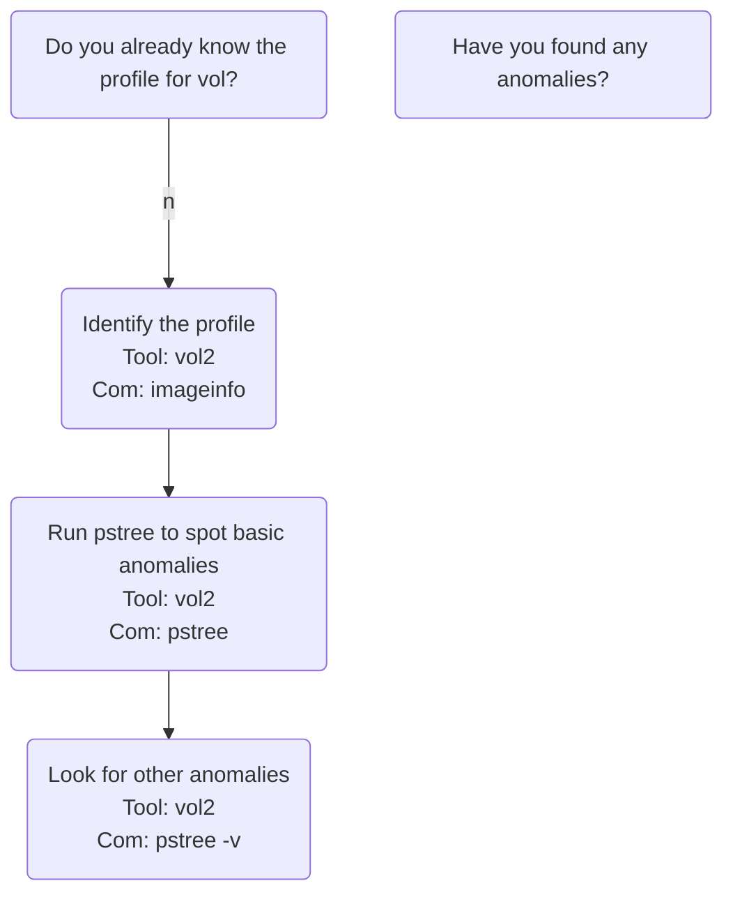

# Comments

BIG TODO, not yet usefull.

# Comments
- Always write down your found  anomalies! I will not make extra junctions for that.

# Flowchart

```mermaid
graph TD;
imageKnown(Do you already know the profile for vol?);
identImage(Identify the profile<br/>Tool: vol2<br/>Com: imageinfo);
hierAnomPstree(Run pstree to spot basic anomalies<br/>Tool: vol2<br/>Com: pstree);
otherAnomPstree(Look for other anomalies<br/>Tool: vol2<br/>Com: pstree -v);
identAnom(Have you found any anomalies?)


imageKnown --no-->identImage;
identImage --> hierAnomPstree;
hierAnomPstree --> otherAnomPstree;

```
