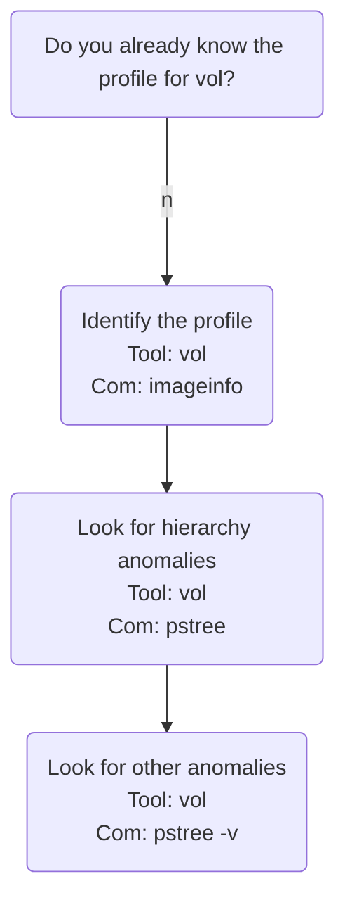

```mermaid
graph TD;
imageKnown(Do you already know the profile for vol?);
identImage(Identify the profile<br/>Tool: vol<br/>Com: imageinfo);
hierAnom(Look for hierarchy anomalies<br/>Tool: vol<br/>Com: pstree);
otherAnom(Look for other anomalies<br/>Tool: vol<br/>Com: pstree -v);

imageKnown --no-->identImage;
identImage --> hierAnom;
hierAnom --> otherAnom;


```
